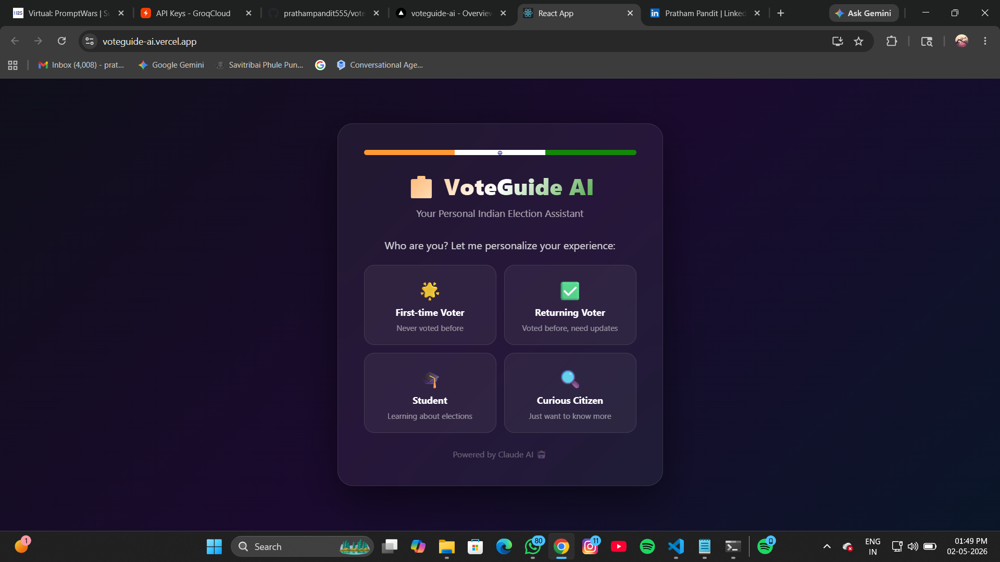
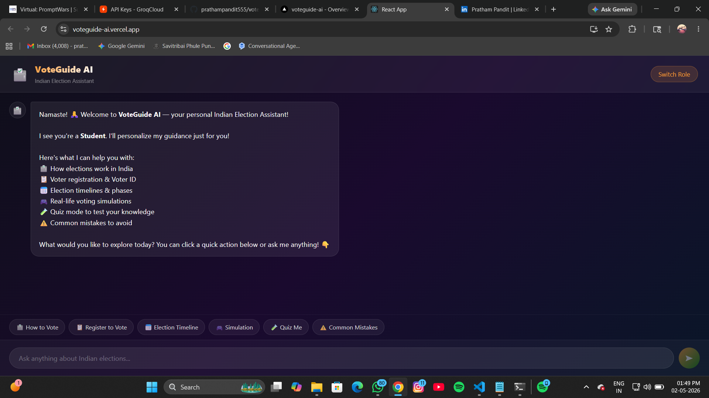
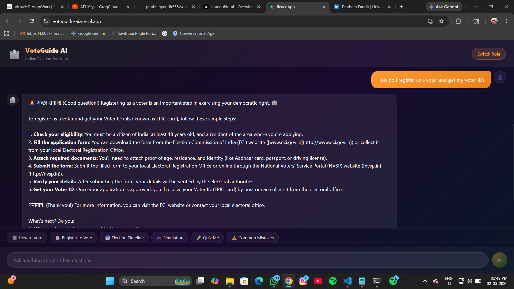

# 🗳️ VoteGuide AI — Indian Election Assistant

> An AI-powered interactive assistant that helps Indian citizens understand the election process through personalized guidance, simulations, and quizzes.

   

## 📸 Screenshots

### Onboarding Screen


### Chat Interface


### AI Response


## 🌟 Live Demo
👉 **[Click here to try VoteGuide AI](https://voteguide-ai.vercel.app/)**

## 📝 Blog Post
👉 **[Read how I built this on Dev.to](https://dev.to/prathampandit555/i-built-an-ai-powered-indian-election-guide-heres-how-3f2j)**

> Select your role → Ask anything → Get instant AI guidance!

## 📌 Problem Statement
Many Indian citizens, especially first-time voters, struggle to understand:
- How elections actually work
- What steps to follow on voting day
- What mistakes to avoid
- Their rights and duties as voters

Existing solutions are **static, boring, and not user-friendly.**

## 💡 Solution
VoteGuide AI is a **fully interactive, AI-powered assistant** that:
- 🎯 Personalizes guidance based on user role
- 🗣️ Answers any election question in simple language
- 🎮 Simulates real-life voting scenarios
- 🧪 Tests knowledge through interactive quizzes
- ⚠️ Warns about common mistakes with smart feedback

## 🚀 Key Features

### 👤 Role-Based Personalization
Users select their role on entry:
- 🌟 First-time Voter
- ✅ Returning Voter
- 🎓 Student
- 🔍 Curious Citizen

The AI adapts its tone, depth, and guidance accordingly.

### 🤖 AI-Powered Chat
- Real-time conversational AI using LLaMA 3.3 70B via Groq
- Understands context across the conversation
- References Election Commission of India (ECI) guidelines

### 🎮 Simulation Mode
Real-life voting scenarios with decision-based learning:
- User makes choices
- AI gives instant feedback on wrong decisions
- Shows real-world consequences

### 🧪 Quiz Mode
- Multiple choice questions about Indian elections
- Score tracking
- Detailed explanations for each answer

### 📅 Election Timeline
- Complete breakdown of Indian election phases
- Before, during, and after voting guidance

## 🛠️ Tech Stack

| Technology | Purpose |
|---|---|
| React 18 | Frontend UI |
| Groq API (LLaMA 3.3 70B) | AI Intelligence |
| Express.js | Backend Proxy Server |
| Node.js | Runtime Environment |
| CSS3 | Styling & Animations |

## ⚙️ How It Works

1. User selects their role (First-time voter, Student, etc.)
2. AI personalizes the welcome and guidance
3. User interacts via chat or quick action buttons
4. Express proxy securely forwards requests to Groq AI
5. AI responds with contextual, accurate election information

## 🏃 Getting Started

### Prerequisites
- Node.js v18+
- Groq API Key (free at [console.groq.com](https://console.groq.com))

### Installation

```bash
# Clone the repository
git clone https://github.com/prathampandit555/voteguide-ai.git
cd voteguide-ai

# Install dependencies
npm install

# Create .env file
echo "GROQ_API_KEY=your_groq_api_key_here" > .env

# Start the proxy server (Terminal 1)
node server.js

# Start the React app (Terminal 2)
npm start
```

## 🔒 Security
- API keys stored in `.env` file (never committed to GitHub)
- Backend proxy prevents direct API exposure
- Only election-related queries are processed

## 🌟 Why VoteGuide AI Stands Out

| Feature | Static Websites | VoteGuide AI |
|---|---|---|
| Personalization | ❌ | ✅ Role-based |
| Interactivity | ❌ | ✅ Full chat |
| Simulation | ❌ | ✅ Real scenarios |
| Quiz Mode | ❌ | ✅ With scoring |
| AI Feedback | ❌ | ✅ Smart feedback |
| Mobile Friendly | ❌ | ✅ Responsive |

## 📚 References
- [Election Commission of India](https://www.eci.gov.in)
- [Voter Registration Portal](https://voters.eci.gov.in)
- [Groq AI](https://groq.com)

## 👨‍💻 Author
**Pratham Pandit**
- GitHub: [@prathampandit555](https://github.com/prathampandit555)

---
*Built with ❤️ for PromptWars — Build with AI*
